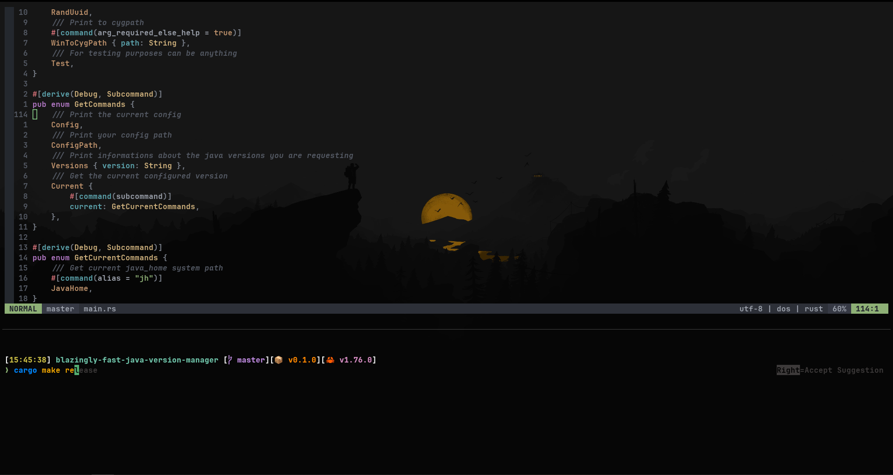

# The cat dotfiles on Windows

My dotfiles are just my windows minimal configuration for some tools I use to make my terminal experience awesome.
It contains my ideavimrc as well as I am mainly a Java developer.
If you want to use them or just pick few things in it, feal free to do so, but at your own risk :smirk:.
This run on native windows CMD btw.




If you use a linux distro I use ubuntu as well with fish instead of clink : [dotfiles-ubuntu](https://github.com/theCat69/dotfiles-ubuntu) 

## Contents

- clink
- wezterm
- neovim
- starship
- gitui
- ideavimrc

## Installation 

### Notes about installation

What works best for me is ususally installing with winget when i can then cargo with the "cargo install".
However, you can use any package manager you like. 

### Set up your environment

> **Note**
> I personally use environment variables to setup my stuff on different systems and i often keep the same ordering of folders. You can follow along if you like or do something completly different but you will have to search for every path in every lua file to be sure everything is at the right place on disk

```sh
 set DEV=C:\dev
 set HOME=C:\Users\<username>
 set DOTFILES=C:\dev\.dotfiles
```

### Clone this repo

- clone it under %DOTFILES%
```sh
git clone --recurse-submodules <url> %DOTFILES%
```

### Install MSYS2
- MSYS2 : [msys2 website](https://www.msys2.org/)
- Install msys2 package by opening msys2 console :
```sh
pacman -S mingw-w64-ucrt-x86_64-{gcc,cmake,make,ninja,diffutils}
```
- Add both to Path environment variable during installation (I personally always let them to have access to native unix like command and a c compiler).
```sh
set PATH=c:\msys64\ucrt64\bin;c:\msys64\usr\bin;%PATH%
```

### Install Wezterm 

#### Build from source
- Install strawberry pearl : [install pearl](https://strawberryperl.com/)
- Rust : [install rust](https://www.rust-lang.org/)
- Wezterm : [download and build](https://github.com/wez/wezterm)

#### Install release or nightly
- Wezterm : [download and install](https://wezfurlong.org/wezterm/installation)

### Install Clink

- Clink portable : [download](https://github.com/chrisant996/clink/releases)
- Put it under %DEV%/terminal/clink the exe should be accessible like so %DEV%/terminal/clink/clink_x64.exe
- Remove the prefix on default_settings and default_inputrc as written [here](https://chrisant996.github.io/clink/clink.html#gettingstarted_enhanceddefaults)

### Install Zoxide

- Zoxide : [install via winget](https://github.com/ajeetdsouza/zoxide)
- Add zoxide.exe to Path

### Install Starship

- Starship : [download via winget](https://github.com/starship/starship)
- Add starship.exe to Path

### Install Ripgrep

- Ripgrep : [install or build from source](https://github.com/BurntSushi/ripgrep)
- Add rg.exe to Path

### Install Fzf

- Fzf : [install](https://github.com/junegunn/fzf)
- Add fzf.exe to Path

### Install Bat 

- Bat : [install](https://github.com/sharkdp/bat)
- Add bat.exe to Path

### Install Eza 

- Eza : [install](https://github.com/eza-community/eza)
- Add eza.exe to Path

### Install Neovim

- Neovim : [download](https://github.com/neovim/neovim) and [build it from source](https://github.com/neovim/neovim/blob/master/BUILD.md)
- Add nvim.exe to Path
- LSP in neovim will require you to have each langage toolchain to be setup but you might not require them all. The list can be found in .config/nvim/after/plugin/mason_lsp.lua comment some all or none of them at your convinience.

### Install Gitui

- Gitui : [download or build from source](https://github.com/extrawurst/gitui)
- Add gitui.exe to Path

### Link the configuration

> **Note**
> I wanted to use stow to try it but this require Admin rights and you might not always be able to have those rights on every machine you work with. So you could, maybe, use instead, a copy script that require a command to commit your config files or you could use a watcher to auto update when you modify those file

- Install stow on MSYS2
```sh
pacman -S stow
```

- Modify your environment to have MSYS=winsymlinks:nativestrict
- Open MSYS prompt as administrator, go to this project directory ($DEV/.dotfiles) and run
> **Note**
> If you can't have administrator rights you could use the developer settings for windows instead that will allow you to make windows symlink (shortcut) without admin rights.

```sh
stow . -t $HOME
./install-scripts/deploy-starship.sh 
./install-scripts/deploy-nvim.sh 
./install-scripts/deploy-gitui.sh 
./install-scripts/deploy-bat.sh 
```

- If you use IntelliJ you can additionaly use my ideavimrc 
```sh
./install-scripts/deploy-ideavimrc.sh 
```

### Take a break

Get a nice and cold bear. Sit, relax, open wezterm and enjoy !

## Additional tools

### Topgrade
A really nice and minimalist version cross-platform version manager.
- Topgrade : [install](https://github.com/topgrade-rs/topgrade)
```sh
./install-scripts/deploy-topgrade.sh 
```
> **Note**
> I use custom scripts to build projects i got from github and build manually from source. Check them out before using topgrade.

### Fd
Alternative to find and works on every system.
- Fd : [install](https://github.com/sharkdp/fd)
> **Note**
> no config installation for fd
