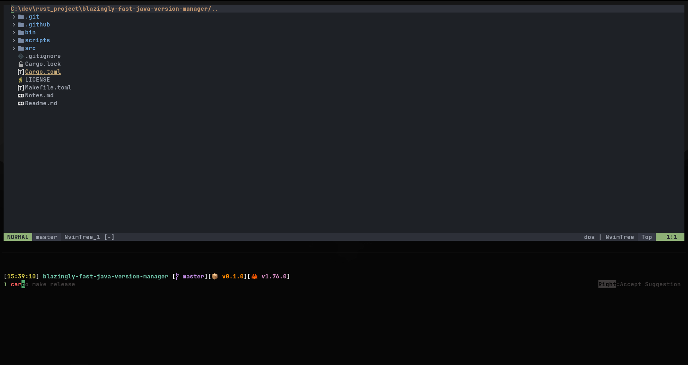

# The cat dotfiles on Windows

My dotfiles are just my windows minimal configuration for some tools I use to make my terminal experience awesome.
It contains my ideavimrc as well as I am mainly a Java developer.
If you want to use them or just pick few things in it, feal free to do so, but at your own risk :smirk:.



## Contents

- clink
- wezterm
- neovim
- starship
- gitui
- ideavimrc

## Installation

- Install MSYS2
- Install stow on MSYS2
```sh
pacman -S stow
```
- Modify your environment to have MSYS=winsymlinks:nativestrict
- Open MSYS prompt as administrator and run
```sh
stow . -t /c/Users/<username>
./install-scripts/deploy-starship.sh 
./install-scripts/deploy-nvim.sh 
./install-scripts/deploy-ideavimrc.sh 
```

